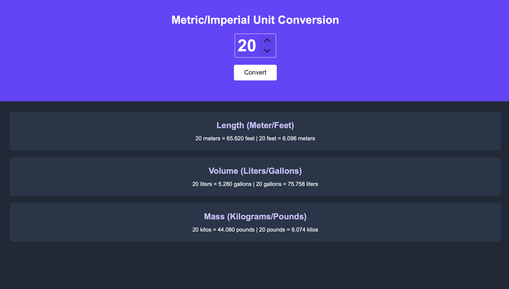

# 📏 Metric / Imperial Unit Converter

A modern and responsive **Unit Converter** built with **HTML**, **CSS**, and **JavaScript**. The application instantly converts between Metric and Imperial units for **Length**, **Volume**, and **Mass** with accurate results rounded to three decimal places.

🌐 **Live Demo:** https://your-vercel-link.vercel.app/

> Replace the above URL with your deployed Vercel link.

---

## 📸 Preview



---

## ✨ Features

- 📏 Convert Meters ↔ Feet
- 🧪 Convert Liters ↔ Gallons
- ⚖️ Convert Kilograms ↔ Pounds
- 🔢 Custom input value
- 🎯 Results rounded to 3 decimal places
- ⚡ Instant conversion
- 📱 Responsive Design
- 🎨 Modern UI inspired by Scrimba's Figma design

---

## 🚀 Live Demo

**Vercel**

https://your-vercel-link.vercel.app/

---

## 🛠️ Built With

- HTML5
- CSS3
- JavaScript (ES6)

---

## 📂 Project Structure

```text
Unit-Converter/
│
├── index.html
├── index.css
├── index.js
├── preview1.png
└── README.md
```

---

## 🚀 Getting Started

### Clone the repository

```bash
git clone https://github.com/BinaryBlaze16/Unit-Converter.git
```

### Navigate to the project

```bash
cd Unit-Converter
```

### Run the project

Open the `index.html` file in your browser

or

Use **VS Code Live Server**.

---

## 📐 Conversion Formulas

### Length

- 1 Meter = 3.281 Feet
- 1 Foot = 0.3048 Meters

### Volume

- 1 Liter = 0.264 Gallons
- 1 Gallon = 3.785 Liters

### Mass

- 1 Kilogram = 2.204 Pounds
- 1 Pound = 0.453 Kilograms

---

## 📱 Responsive Design

The application is optimized for:

- 💻 Desktop
- 💼 Laptop
- 📱 Mobile
- 📟 Tablet

---

## 📚 What I Learned

While building this project, I improved my understanding of:

- DOM Manipulation
- JavaScript Functions
- Event Listeners
- Mathematical Calculations
- Number Formatting with `toFixed()`
- Responsive Web Design
- CSS Flexbox
- Clean UI Development

---

## 🎯 Future Improvements

- 🌙 Light / Dark Theme
- 🔄 Real-time conversion while typing
- 📋 Copy converted values
- 📚 Conversion history
- 🌍 More unit categories
- 🌡️ Temperature Converter
- 📐 Area & Speed Converter

---

## 👨‍💻 Author

**Anant Srivastava**

GitHub: https://github.com/BinaryBlaze16

---

## 🤝 Contributing

Contributions, issues, and feature requests are welcome.

Feel free to fork this repository and submit a pull request.

---

## ⭐ Support

If you like this project, please give it a ⭐ on GitHub.

Your support motivates me to build more awesome projects!

---

## 📄 License

This project is licensed under the **MIT License**.